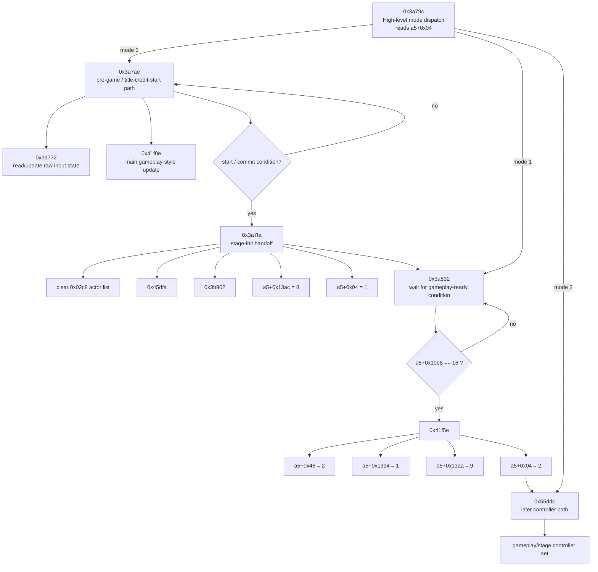
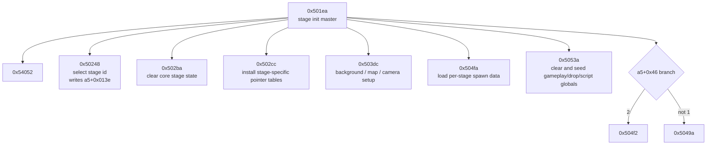
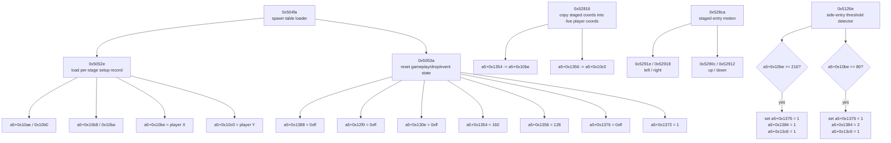
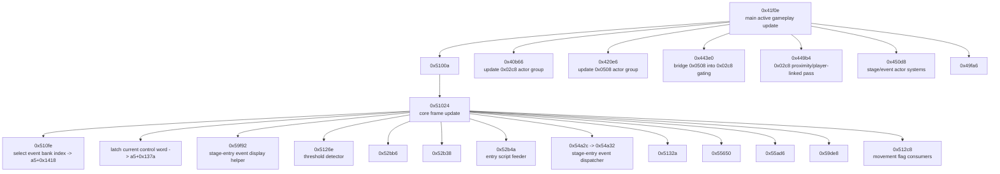

# Rastan Startup To Gameplay Flow

This is a compact address-based flow diagram for the path from title/start into
stage initialization and the first active gameplay loop.

It is not the whole program. It is the part currently most useful for finding
the true start of gameplay and the player spawn/drop handoff.

## High-level flow

## Stage initialization chain

This is the setup sequence reached from `0x3a7fa`.

## Stage-start spawn and drop path

This is the strongest current path for the first live player placement.

## First active gameplay loop

This is the frame loop I would currently treat as the best "gameplay has begun"
anchor.

## What to watch if you want to find "gameplay starts here"

- `0x3a7fa`
  This is the cleanest known handoff out of the pre-game/title-credit phase.
- `0x501ea`
  This is the stage initialization master.
- `0x5052e`
  This is where the first stage/player coordinates are loaded.
- `0x52816`
  This is where staged entry coordinates become the live player position.
- `0x41f0e / 0x51024`
  This is the first confirmed recurring gameplay update loop worth treating as
  active play.

## Suggested next reverse-engineering checkpoints

- Find who first calls or enables `0x41f0e` from the title/credit/start flow.
- Find where `a5 + 0x10be / 0x10c0` first become visible-body actor
  coordinates.
- Find the first actor constructor after `0x501ea` that seeds the player body
  with its true class/family/palette data.
